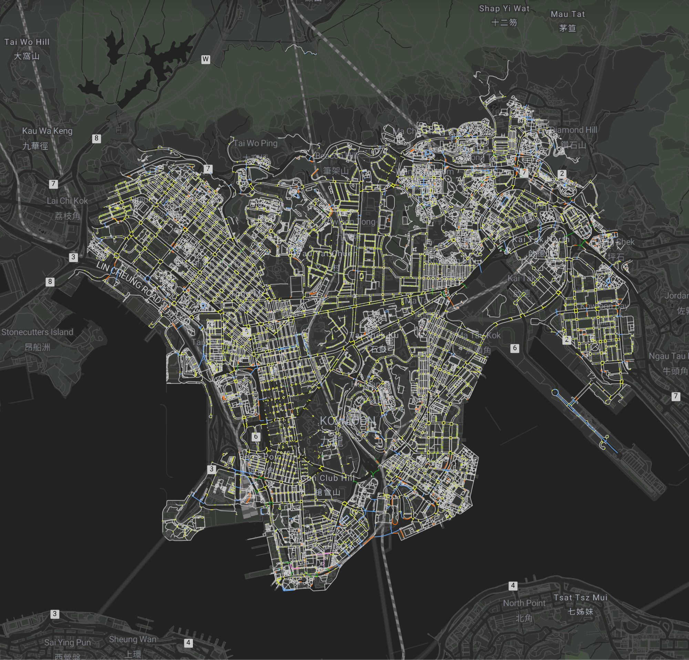
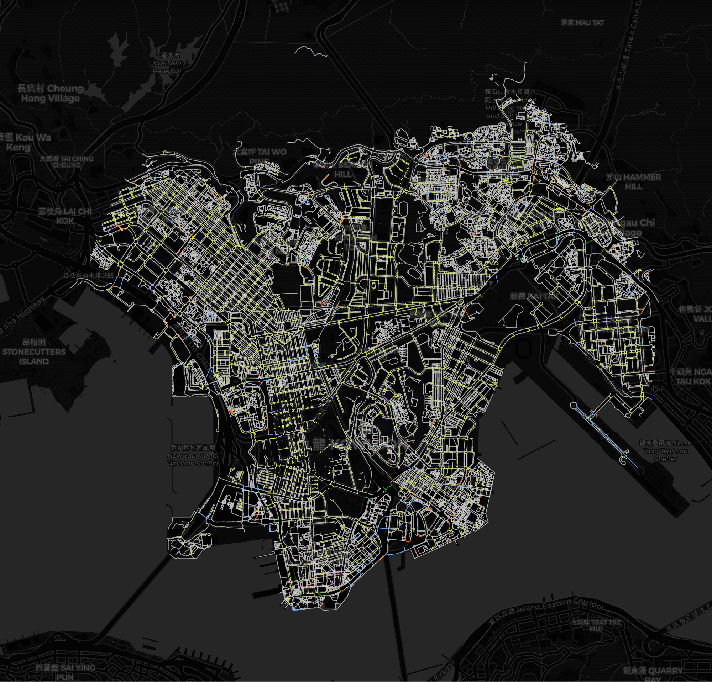
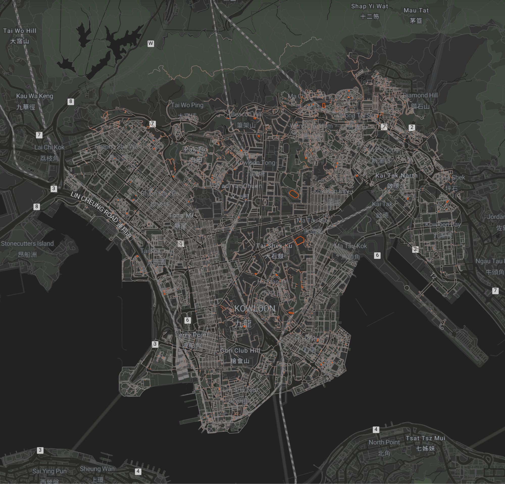
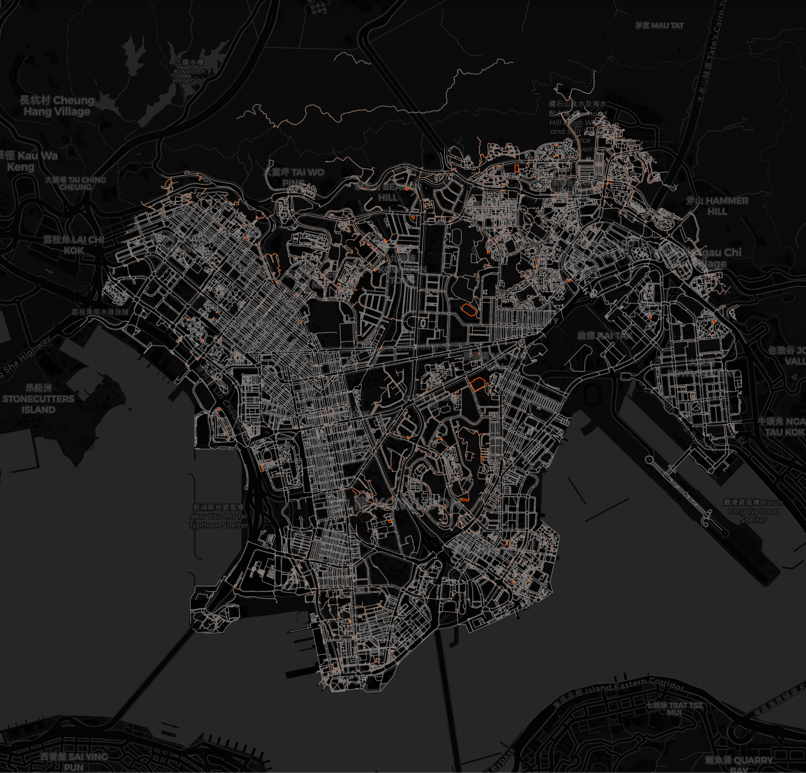
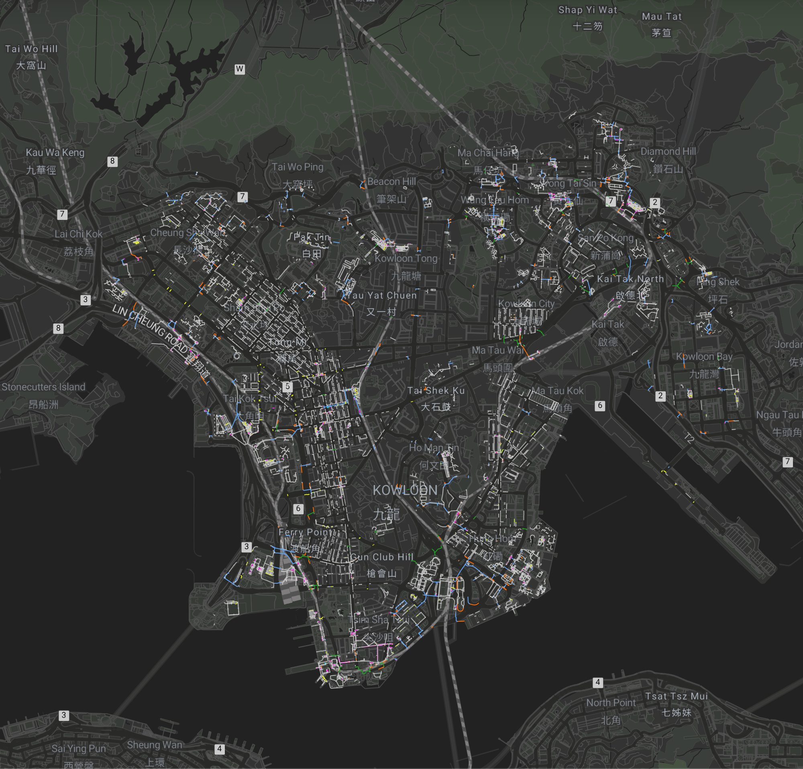
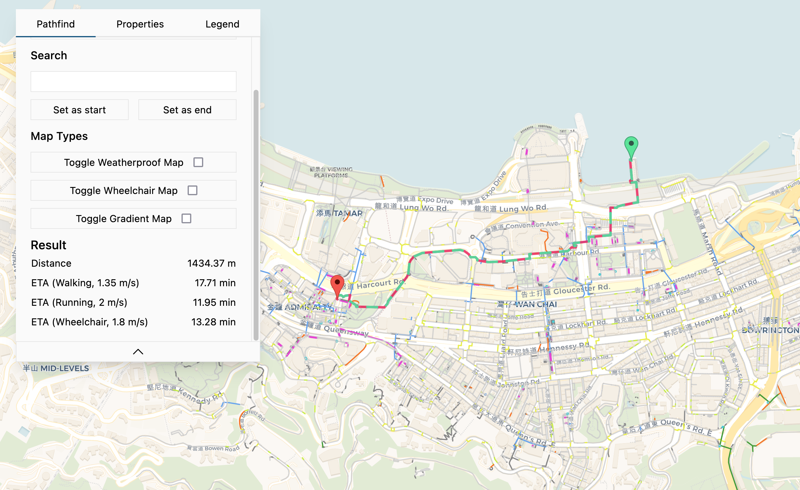

# HKPathfinder

A map application specifically for people with special needs, submitted to [Open Data Hackathon 2022](https://events.hk-tag.org/smartproperty/).

## Demo

### Wheelchair Map

    
    

### Gradient Map

    
    

### Weatherproof Map

    
    

### Pathfinding

## Reference

[3D Pedestrian Network](https://portal.csdi.gov.hk/geoportal/#metadataInfoPanel)
