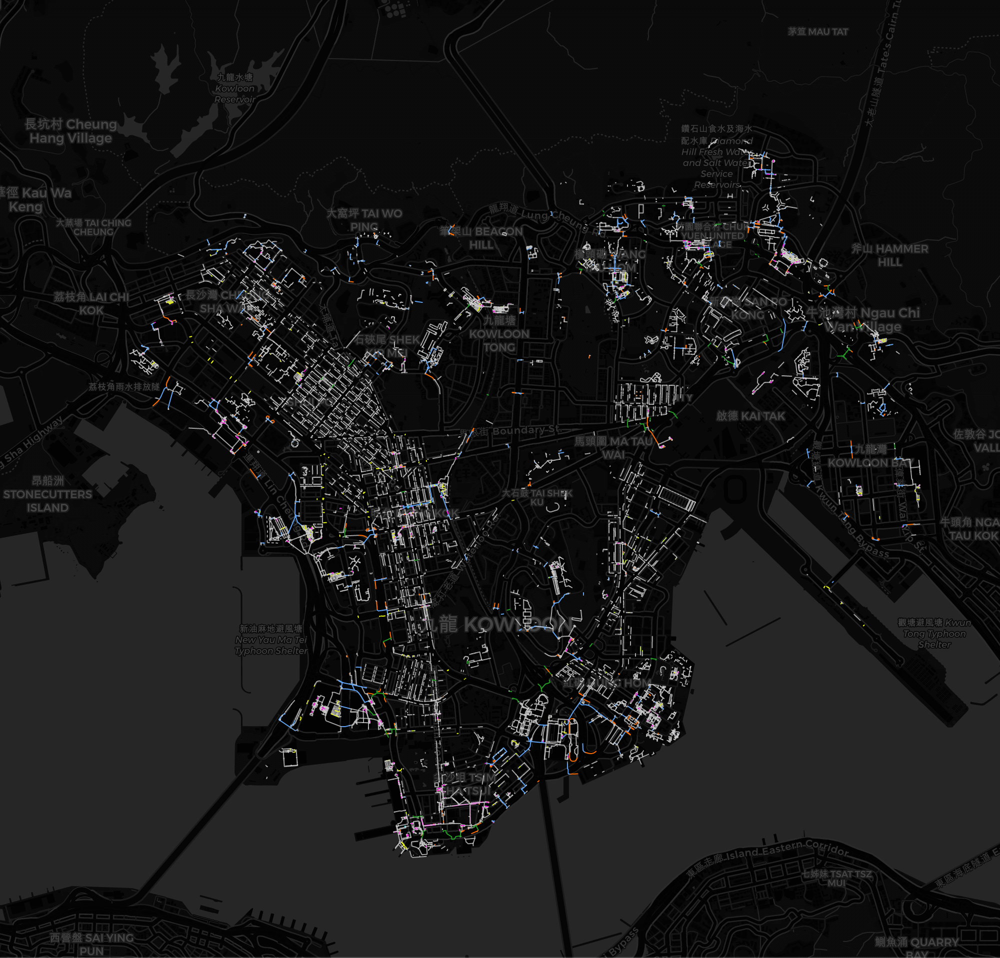

# HKPathfinder

A map application specifically for people with special needs, submitted to [Open Data Hackathon 2022](https://events.hk-tag.org/smartproperty/).

## Demo

### Wheelchair Map

### Gradient Map

### Weatherproof Map

## Reference

[3D Pedestrian Network](https://portal.csdi.gov.hk/geoportal/#metadataInfoPanel)
